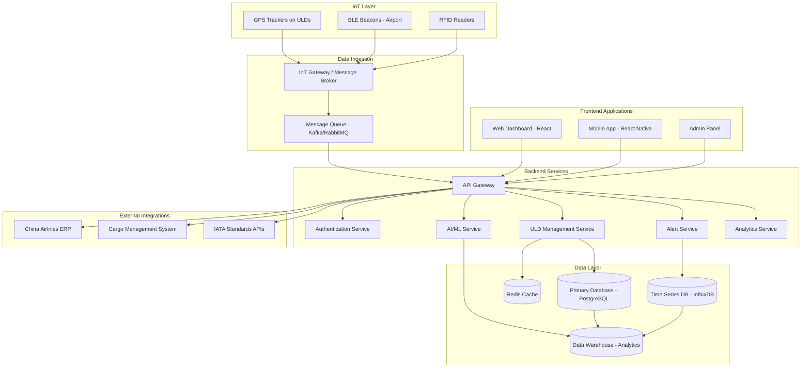
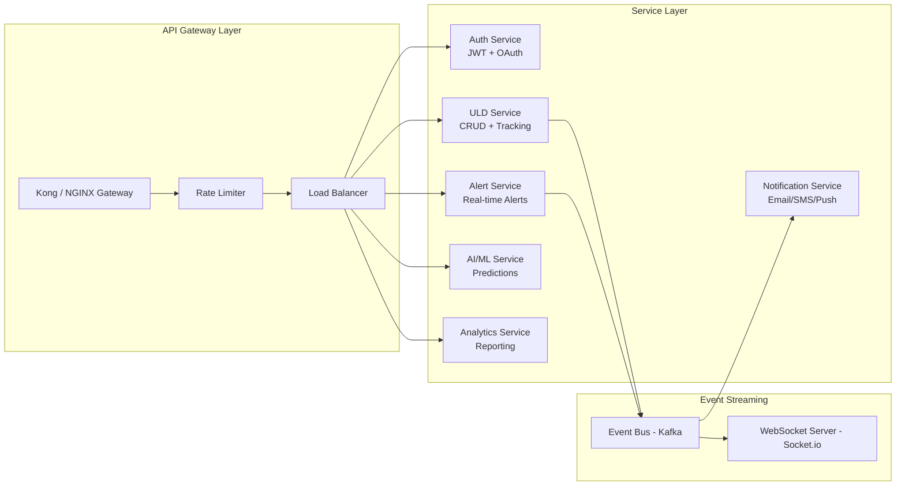
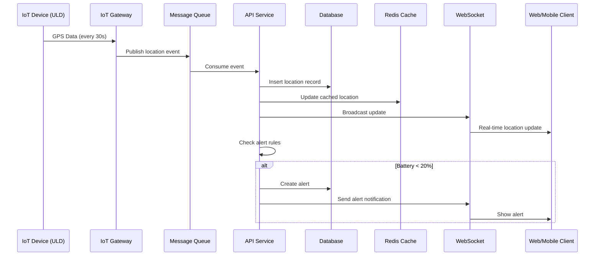
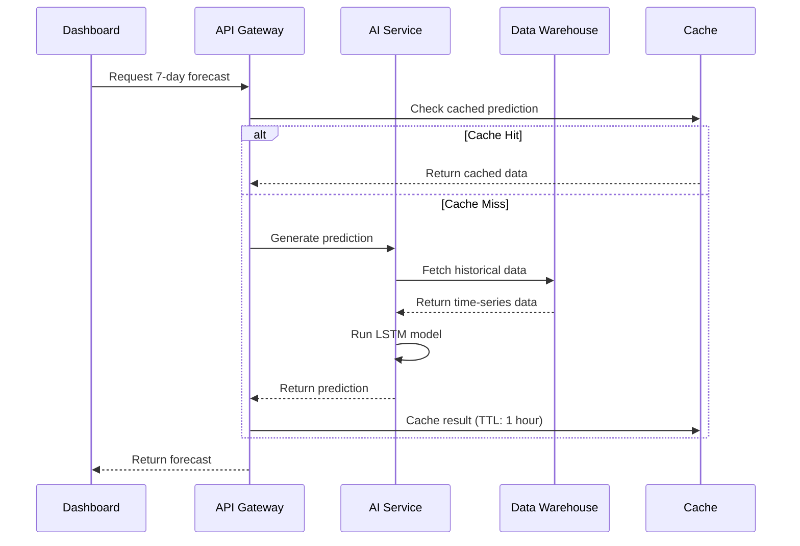
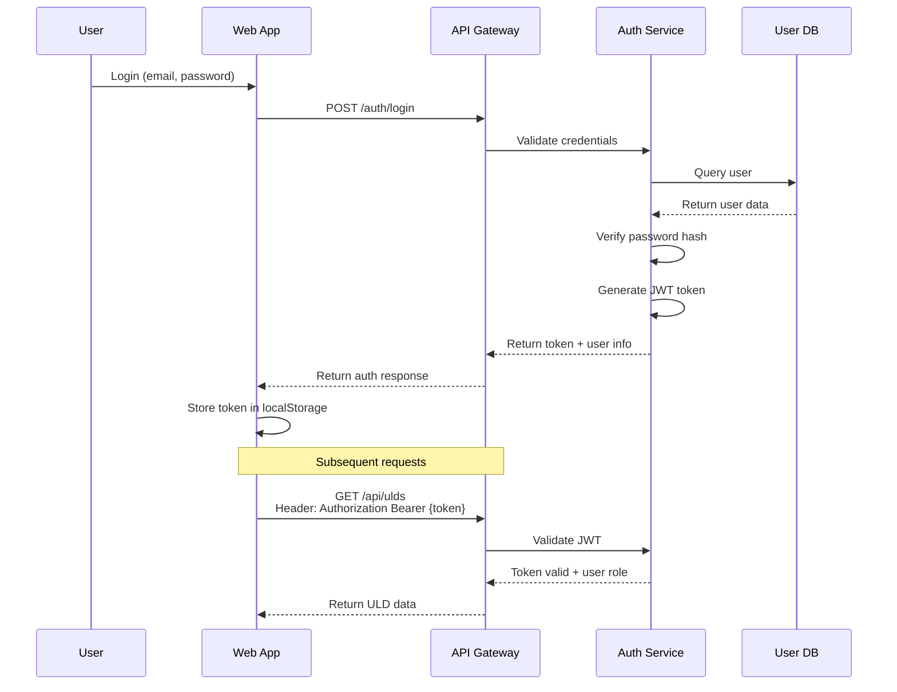
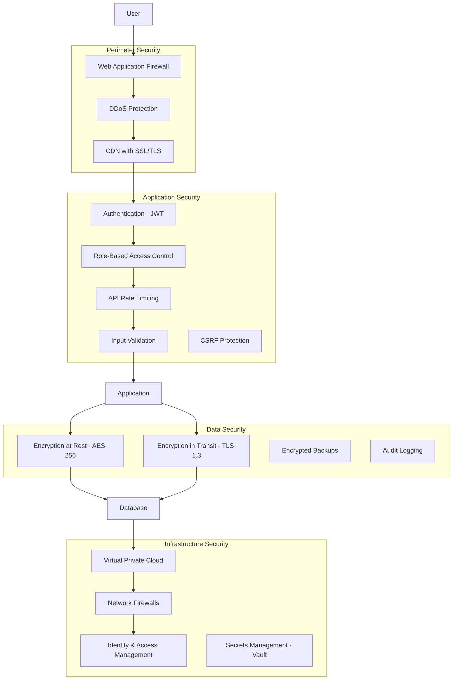

# System Architecture & Technical Design
## China Airlines Smart ULD Management System

**Document Version:** 1.0  
**Date:** November 2025

---

## Table of Contents

1. [System Overview](#system-overview)
2. [High-Level Architecture](#high-level-architecture)
3. [Component Architecture](#component-architecture)
4. [Data Flow Diagrams](#data-flow-diagrams)
5. [Technology Stack](#technology-stack)
6. [Infrastructure Design](#infrastructure-design)
7. [Security Architecture](#security-architecture)
8. [Scalability & Performance](#scalability--performance)

---

## System Overview

### Executive Summary

The Smart ULD Management System is a distributed, cloud-native application designed to provide real-time tracking, AI-powered analytics, and intelligent automation for Unit Load Devices (ULDs) across China Airlines' global network.

### Core Capabilities

- **Real-time Tracking:** GPS/BLE-based location tracking with <5s update latency
- **Predictive Analytics:** AI-driven demand forecasting and anomaly detection
- **Automation:** Smart alerts, reallocation suggestions, maintenance scheduling
- **Multi-platform:** Web dashboard, mobile apps, API integrations
- **Global Scale:** Support for 500+ ULDs across 20+ airports

---

## High-Level Architecture



---

## Component Architecture

### 1. IoT Layer

#### Hardware Components

| Component | Technology | Purpose | Battery Life |
|-----------|------------|---------|--------------|
| **GPS Tracker** | LoRaWAN / NB-IoT | Outdoor location tracking | 3-5 years |
| **BLE Beacon** | Bluetooth 5.0 | Indoor positioning | 2-3 years |
| **RFID Tag** | Passive UHF RFID | Quick scanning at gates | Passive (no battery) |
| **Sensors** | Multi-sensor module | Temperature, humidity, shock | 3-5 years |

#### Communication Protocol

```
ULD IoT Device → LoRaWAN/NB-IoT Gateway → Cloud Platform
              → BLE Gateway (Airport) → Cloud Platform
              → RFID Reader → Cloud Platform
```

---

### 2. Backend Microservices Architecture



#### Service Details

**Authentication Service**
- JWT token generation and validation
- OAuth 2.0 integration
- Role-based access control (RBAC)
- Session management

**ULD Management Service**
- CRUD operations for ULD data
- Real-time location updates
- Status management
- Historical movement tracking

**Alert Service**
- Rule-based alert generation
- Threshold monitoring (battery, temperature, etc.)
- Priority classification (Critical, Warning, Info)
- Alert notification routing

**AI/ML Service**
- Demand forecasting (LSTM models)
- Anomaly detection (Isolation Forest)
- Optimization algorithms (Linear Programming)
- Predictive maintenance

**Analytics Service**
- KPI calculation and aggregation
- Custom report generation
- Data export (CSV, Excel, PDF)
- Business intelligence dashboards

---

### 3. Data Architecture

#### Database Schema Design

**Primary Database: PostgreSQL**

```sql
-- ULDs Table
CREATE TABLE ulds (
    id VARCHAR(20) PRIMARY KEY,
    type VARCHAR(10) NOT NULL,
    status VARCHAR(20) NOT NULL,
    airport VARCHAR(10),
    current_location_id BIGINT,
    battery_level DECIMAL(5,2),
    created_at TIMESTAMP DEFAULT NOW(),
    updated_at TIMESTAMP DEFAULT NOW()
);

-- Locations Table (Time-series)
CREATE TABLE uld_locations (
    id BIGSERIAL PRIMARY KEY,
    uld_id VARCHAR(20) REFERENCES ulds(id),
    latitude DECIMAL(10,8) NOT NULL,
    longitude DECIMAL(11,8) NOT NULL,
    altitude DECIMAL(10,2),
    zone VARCHAR(50),
    airport VARCHAR(10),
    timestamp TIMESTAMP NOT NULL,
    INDEX idx_uld_timestamp (uld_id, timestamp)
);

-- Sensors Table
CREATE TABLE sensor_readings (
    id BIGSERIAL PRIMARY KEY,
    uld_id VARCHAR(20) REFERENCES ulds(id),
    temperature DECIMAL(5,2),
    humidity DECIMAL(5,2),
    shock_level DECIMAL(5,2),
    battery DECIMAL(5,2),
    timestamp TIMESTAMP NOT NULL,
    INDEX idx_uld_sensor_time (uld_id, timestamp)
);

-- Alerts Table
CREATE TABLE alerts (
    id BIGSERIAL PRIMARY KEY,
    uld_id VARCHAR(20) REFERENCES ulds(id),
    type VARCHAR(20) NOT NULL,
    severity VARCHAR(10) NOT NULL,
    title VARCHAR(100) NOT NULL,
    message TEXT,
    resolved BOOLEAN DEFAULT FALSE,
    created_at TIMESTAMP DEFAULT NOW(),
    INDEX idx_uld_alerts (uld_id, created_at)
);

-- Users Table
CREATE TABLE users (
    id BIGSERIAL PRIMARY KEY,
    email VARCHAR(100) UNIQUE NOT NULL,
    password_hash VARCHAR(255) NOT NULL,
    role VARCHAR(20) NOT NULL,
    airport VARCHAR(10),
    active BOOLEAN DEFAULT TRUE,
    created_at TIMESTAMP DEFAULT NOW()
);
```

#### Data Partitioning Strategy

- **Locations Table:** Partition by month (time-series optimization)
- **Sensor Readings:** Partition by month + ULD range
- **Alerts:** Partition by severity + month

#### Caching Strategy (Redis)

```
Cache Key Pattern:
- uld:{id} → ULD basic info (TTL: 5 min)
- uld:{id}:location → Latest location (TTL: 10 sec)
- uld:{id}:sensors → Latest sensor data (TTL: 10 sec)
- dashboard:metrics → Dashboard KPIs (TTL: 1 min)
- alerts:active → Active alerts list (TTL: 30 sec)
```

---

## Data Flow Diagrams

### Real-time Location Update Flow



### AI Prediction Flow



### User Authentication Flow



---

## Technology Stack

### Frontend

| Component | Technology | Purpose |
|-----------|------------|---------|
| **Framework** | React 18 + TypeScript | Component-based UI |
| **Build Tool** | Vite 5 | Fast development & build |
| **State Management** | Redux Toolkit / Zustand | Global state |
| **Routing** | React Router v6 | Client-side routing |
| **Maps** | Leaflet + React-Leaflet | Interactive maps |
| **Charts** | Recharts / Chart.js | Data visualization |
| **UI Library** | Material-UI / Ant Design | Component library |
| **Real-time** | Socket.io-client | WebSocket connection |
| **API Client** | Axios / React Query | HTTP requests + caching |
| **Forms** | React Hook Form + Zod | Form handling + validation |
| **i18n** | react-i18next | Internationalization |

### Backend

| Component | Technology | Purpose |
|-----------|------------|---------|
| **Runtime** | Node.js 20 LTS | JavaScript runtime |
| **Framework** | Express.js / NestJS | REST API framework |
| **Language** | TypeScript | Type-safe development |
| **API Gateway** | Kong / NGINX | API management |
| **Real-time** | Socket.io | WebSocket server |
| **Message Queue** | Kafka / RabbitMQ | Event streaming |
| **Authentication** | Passport.js + JWT | Auth middleware |
| **Validation** | Joi / Zod | Input validation |
| **ORM** | Prisma / TypeORM | Database ORM |
| **Job Queue** | Bull + Redis | Background jobs |
| **Logging** | Winston + Morgan | Application logging |
| **Testing** | Jest + Supertest | Unit & integration tests |

### Databases & Storage

| Component | Technology | Purpose |
|-----------|------------|---------|
| **Primary DB** | PostgreSQL 15 | Relational data |
| **Cache** | Redis 7 | In-memory cache |
| **Time-series** | InfluxDB / TimescaleDB | Sensor/location data |
| **Data Warehouse** | Amazon Redshift / BigQuery | Analytics |
| **Object Storage** | AWS S3 / Azure Blob | File storage |
| **Search** | Elasticsearch | Full-text search |

### AI/ML Stack

| Component | Technology | Purpose |
|-----------|------------|---------|
| **Framework** | TensorFlow / PyTorch | Deep learning |
| **Language** | Python 3.11 | ML development |
| **Time-series** | Prophet / LSTM | Forecasting |
| **Anomaly Detection** | Isolation Forest | Outlier detection |
| **Optimization** | SciPy / PuLP | Linear programming |
| **Data Processing** | Pandas + NumPy | Data manipulation |
| **Model Serving** | TensorFlow Serving / FastAPI | Model deployment |
| **MLOps** | MLflow | Model versioning & tracking |

### DevOps & Infrastructure

| Component | Technology | Purpose |
|-----------|------------|---------|
| **Cloud Platform** | AWS / Azure / GCP | Cloud infrastructure |
| **Containers** | Docker | Application containerization |
| **Orchestration** | Kubernetes (K8s) | Container orchestration |
| **CI/CD** | GitHub Actions / GitLab CI | Automation pipeline |
| **IaC** | Terraform | Infrastructure as code |
| **Monitoring** | Datadog / New Relic | Application monitoring |
| **Logging** | ELK Stack (Elasticsearch, Logstash, Kibana) | Centralized logging |
| **Error Tracking** | Sentry | Error monitoring |
| **CDN** | CloudFront / Cloudflare | Content delivery |
| **Load Balancer** | AWS ALB / NGINX | Traffic distribution |

### Mobile

| Component | Technology | Purpose |
|-----------|------------|---------|
| **Framework** | React Native / Flutter | Cross-platform mobile |
| **State** | Redux / MobX | State management |
| **Navigation** | React Navigation | Mobile routing |
| **Push Notifications** | Firebase Cloud Messaging (FCM) | Notifications |
| **Offline Storage** | AsyncStorage / SQLite | Local data persistence |

---

## Infrastructure Design

### Cloud Architecture (AWS Example)

```
┌─────────────────────────────────────────────────────────┐
│                     Route 53 DNS                        │
└────────────────────┬────────────────────────────────────┘
                     │
┌────────────────────▼────────────────────────────────────┐
│              CloudFront CDN (Global)                    │
└────────────────────┬────────────────────────────────────┘
                     │
┌────────────────────▼────────────────────────────────────┐
│         Application Load Balancer (ALB)                 │
└──────┬──────────────────────────────────────────┬───────┘
       │                                          │
┌──────▼─────────┐                      ┌────────▼────────┐
│   Web Tier     │                      │   API Tier      │
│   (S3 +        │                      │   (ECS/EKS)     │
│   CloudFront)  │                      │   Auto-scaling  │
└────────────────┘                      └────────┬────────┘
                                                 │
                    ┌────────────────────────────┼────────────────┐
                    │                            │                │
          ┌─────────▼────────┐        ┌─────────▼────────┐  ┌───▼────────┐
          │ RDS PostgreSQL   │        │  ElastiCache     │  │  SQS/SNS   │
          │ (Multi-AZ)       │        │  Redis           │  │  Queues    │
          └──────────────────┘        └──────────────────┘  └────────────┘
```

### Kubernetes Cluster Architecture

```yaml
apiVersion: apps/v1
kind: Deployment
metadata:
  name: uld-api-deployment
spec:
  replicas: 3
  selector:
    matchLabels:
      app: uld-api
  template:
    metadata:
      labels:
        app: uld-api
    spec:
      containers:
      - name: api
        image: china-airlines/uld-api:latest
        ports:
        - containerPort: 3000
        env:
        - name: DATABASE_URL
          valueFrom:
            secretKeyRef:
              name: db-secrets
              key: url
        resources:
          requests:
            memory: "512Mi"
            cpu: "250m"
          limits:
            memory: "1Gi"
            cpu: "500m"
        livenessProbe:
          httpGet:
            path: /health
            port: 3000
          initialDelaySeconds: 30
          periodSeconds: 10
        readinessProbe:
          httpGet:
            path: /ready
            port: 3000
          initialDelaySeconds: 10
          periodSeconds: 5
---
apiVersion: v1
kind: Service
metadata:
  name: uld-api-service
spec:
  selector:
    app: uld-api
  type: LoadBalancer
  ports:
  - protocol: TCP
    port: 80
    targetPort: 3000
---
apiVersion: autoscaling/v2
kind: HorizontalPodAutoscaler
metadata:
  name: uld-api-hpa
spec:
  scaleTargetRef:
    apiVersion: apps/v1
    kind: Deployment
    name: uld-api-deployment
  minReplicas: 3
  maxReplicas: 10
  metrics:
  - type: Resource
    resource:
      name: cpu
      target:
        type: Utilization
        averageUtilization: 70
```

---

## Security Architecture

### Security Layers



### Authentication & Authorization Flow

**JWT Token Structure:**
```json
{
  "header": {
    "alg": "RS256",
    "typ": "JWT"
  },
  "payload": {
    "sub": "user_id_123",
    "email": "user@china-airlines.com",
    "role": "manager",
    "airport": "TPE",
    "permissions": ["read:ulds", "write:ulds", "read:analytics"],
    "iat": 1699334400,
    "exp": 1699420800
  }
}
```

**Role-Based Permissions:**

| Role | Permissions |
|------|-------------|
| **Admin** | Full system access, user management, system configuration |
| **Manager** | View all ULDs, analytics, alerts, manage assignments |
| **Ground Staff** | View assigned ULDs, update locations, scan RFID |
| **Viewer** | Read-only access to dashboards and reports |

### Data Encryption

- **At Rest:** AES-256 encryption for database and file storage
- **In Transit:** TLS 1.3 for all API communications
- **Backups:** Encrypted with separate key management
- **Secrets:** HashiCorp Vault for API keys, credentials

### Compliance & Standards

- **IATA Standards:** ULD tracking and data exchange protocols
- **ISO 27001:** Information security management
- **GDPR:** Data privacy and protection (if applicable)
- **SOC 2:** Security and availability controls
- **Aviation Security:** ICAO Annex 17 compliance

---

## Scalability & Performance

### Performance Targets

| Metric | Target | Current (PoC) |
|--------|--------|---------------|
| **API Response Time** | <200ms (p95) | <100ms |
| **Dashboard Load Time** | <2 seconds | <1 second |
| **Real-time Update Latency** | <5 seconds | <2 seconds |
| **Concurrent Users** | 1,000+ | 10 |
| **ULDs Tracked** | 500+ | 50 |
| **Database Queries/sec** | 10,000+ | 100 |
| **WebSocket Connections** | 1,000+ | 10 |

### Scaling Strategy

#### Horizontal Scaling
- **API Servers:** Auto-scaling based on CPU/memory
- **WebSocket Servers:** Dedicated cluster with Socket.io clustering
- **Database:** Read replicas for query distribution
- **Cache:** Redis Cluster with sharding

#### Vertical Scaling
- **Database:** Scale instance size as needed
- **ML Services:** GPU instances for model training

### Performance Optimization

**Frontend:**
- Code splitting and lazy loading
- Image optimization (WebP, CDN)
- Bundle size reduction (<200KB initial)
- Service Worker for offline capability

**Backend:**
- Database query optimization (indexes, query plans)
- Connection pooling (pg-pool)
- Response compression (gzip/brotli)
- Caching strategy (Redis)

**Database:**
- Partitioning for time-series data
- Materialized views for analytics
- Index optimization
- Archive old data (>1 year) to data warehouse

### Monitoring & Alerting

**Application Monitoring:**
- Response time per endpoint
- Error rate and types
- Resource utilization (CPU, memory)
- Request throughput

**Infrastructure Monitoring:**
- Server health and uptime
- Database performance metrics
- Cache hit/miss ratios
- Network latency

**Business Metrics:**
- Active ULDs tracked
- Alerts generated per hour
- User session duration
- API usage by client

---

## API Design

### REST API Endpoints

**Authentication:**
```
POST   /api/auth/login           - User login
POST   /api/auth/logout          - User logout
POST   /api/auth/refresh         - Refresh JWT token
GET    /api/auth/me              - Get current user
```

**ULD Management:**
```
GET    /api/ulds                 - List all ULDs
GET    /api/ulds/:id             - Get ULD details
POST   /api/ulds                 - Create new ULD
PUT    /api/ulds/:id             - Update ULD
DELETE /api/ulds/:id             - Delete ULD
GET    /api/ulds/:id/history     - Get location history
POST   /api/ulds/:id/location    - Update location (IoT)
```

**Analytics:**
```
GET    /api/analytics/dashboard  - Dashboard KPIs
GET    /api/analytics/reports    - Generate reports
GET    /api/predictions          - AI predictions
GET    /api/predictions/demand   - Demand forecast
```

**Alerts:**
```
GET    /api/alerts               - List alerts
GET    /api/alerts/:id           - Get alert details
PUT    /api/alerts/:id/resolve   - Resolve alert
```

**WebSocket Events:**
```
// Client subscribes
socket.on('uld-update', (data) => { ... })
socket.on('new-alert', (alert) => { ... })
socket.on('system-status', (status) => { ... })

// Server emits
io.emit('uld-update', updatedULD)
io.to(userId).emit('new-alert', alert)
```

---

## Deployment Architecture

### Multi-Region Deployment

```
┌──────────────────────────────────────────────────────────┐
│                   Global Load Balancer                   │
│                  (Route 53 Geo-routing)                  │
└───────┬───────────────────────────────────────┬──────────┘
        │                                       │
┌───────▼──────────┐                  ┌─────────▼─────────┐
│  Asia-Pacific    │                  │  North America    │
│  Region (Tokyo)  │                  │  Region (US-East) │
│                  │                  │                   │
│  - API Servers   │                  │  - API Servers    │
│  - WebSocket     │                  │  - WebSocket      │
│  - Redis Cache   │                  │  - Redis Cache    │
│  - RDS (Replica) │                  │  - RDS (Replica)  │
└──────────────────┘                  └───────────────────┘
        │                                       │
        └──────────────┬────────────────────────┘
                       │
              ┌────────▼────────┐
              │  Primary Region │
              │  (Taiwan)       │
              │                 │
              │  - Master DB    │
              │  - Data Warehouse│
              │  - ML Services  │
              └─────────────────┘
```

---

## Disaster Recovery & Business Continuity

### Backup Strategy

- **Database:** Automated daily backups, point-in-time recovery
- **Retention:** 30 days online, 1 year archived
- **Recovery Time Objective (RTO):** <4 hours
- **Recovery Point Objective (RPO):** <15 minutes

### High Availability

- **Database:** Multi-AZ deployment with automatic failover
- **Application:** Multi-region deployment
- **Load Balancer:** Health checks with automatic instance replacement
- **Uptime SLA:** 99.9% (8.76 hours downtime/year)

---

**Document Control:**
- **Owner:** Technical Architecture Team
- **Approver:** CTO / Technical Lead
- **Review Frequency:** Quarterly
- **Last Updated:** November 2025
